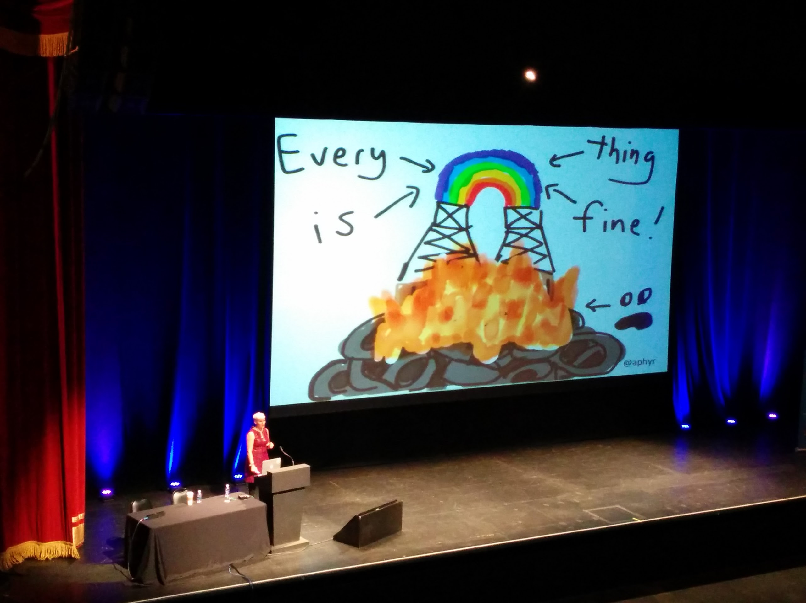

# StrangeLoop 2015

> INTRO HER: Noe om at vi var tre BEKKere som dro på StrangeLoop. Kort hva StrangeLoop er og hva slags temaer som det vanligvis fokuseres på. (Kjetil fixxxxer)

## Teknologi i aktivisme og undertrykkelse

> TODO: finn bedre tittel

Idalin "Abby" Bobé holdt, som en av konferansens keynotes, 

Handlet ikke om teknologi direkte, men om hvordan teknologi kan brukes til godt eller ondt.
Abby har vært aktivist, bla bla, og var har blant annet vært mye i Ferguson ifm urolighetene der. 

Hun fortalte om sin bakgrunn -- om oppveksten som med minoritetsbakgrunn i fattige strøk -- og jobben hennes. Konsulent i ToughtWorks *og* aktivist. 

Teknologi har spilt en viktig rolle for aktivistene mtp deling av hva som skjer, og å få fokus på ting myndighetene forsøker å skjule. Men den samme teknologien blir også brukt mot aktivistene. Med tanke på dette, oppfordret hun alle til stede til å tenke igjennom hvordan de kan bidra.

> Video: ["From Protesting to Programming: Becoming a Tech Activist" by Idalin "Abby" Bobé](https://youtu.be/gy82S8tjJX8)  

Morgan Marquis-Boire fortsatt på sett og vis tråden Abby startet. Han har lang fartstid innen sikkerhet, og har sett mange trussler på nært hold.

Han fortalte om de ulike truslene, 

[Hacking Team](https://en.wikipedia.org/wiki/Hacking_Team)

Underveis fikk vi servert flere anekdoter om ting han selv hadde sett på nært hold, slik som 
... [gode eksempler her]

> Stikkord:
> 
> - Hacking som hyllevare -- Selskap selger "verktøykasser" som brukes til hacking-angrep lovelig
> - Hvem som står bak ulike typer angrep
> - Hvordan forskjellige angrep fungerer (litt overordnet)

> Video: ["Security for Humans: Privacy and Coercion Resistant Design" by Morgan Marquis-Boire](https://youtu.be/k4ypqzOShZs)

Begge disse er foredrag vi anbefaler alle å se.

## Highlights

> Noe om Wadler sitt foredrag. (Kjetil fixes.)

> Video: ["Propositions as Types" by Philip Wadler](https://youtu.be/IOiZatlZtGU)

> Noe om hvem som bør se dette foredraget.

## Distribuerte systemer

Det var stort fokus på distribuerte systemer og streams på årets Strangeloop.

Jon Moore startet fredagen med å presentere sin forskning på hvordan man kan oppnå 
både kausalitet mellom hendelser og synkroniserte klokker i distribuerte systemer.
Løsning hans bygger på teorien om hybride lamport clocks, og heter 'Distributed 
Monotonic Clocks', hvor han bruker flokkteori (insert eksempel på flokk-algoritme her som eksempel)
for å synkronisere klokker i en cluster av maskiner uten at alle maskinene
må kommunisere.

> Video: ["How to Have your Causality and Wall Clocks, Too" by Jon Moore](https://youtu.be/YqNGbvFHoKM)

Peter Bailis(insert pun om game of thrones) forteller oss hvordan det å 
designe systemer for worste case scenario istedet for average case scenario
i noen tilfeller kan gi bedre ytelse i avarge case scenario. 

Your service's corner case may be its consumer's average case.

Design for worst case scenario når:

* Corner cases are common
* Environmental conditions are variable
* When "normal" isn't as normal as you think

Defining "normal" defines our designs. 

> Video: ["When "Worst" is Best (in Distributed Systems)" by Peter Bailis](https://youtu.be/ZGIAypUUwoQ)

Det er jo ofte stort fokus på å bygge stateless services som er lett å skalere. 
Men er servicene våre virkelig stateless? Catie McCaffrey forteller at oss stateless 
services ofte flytter state ned til databasen. Men i noen tilfeller så kan det lønne
seg å designe services som tar vare på state i applikasjonen, noe de for eksempel har gjort i tjenesten Uber.

> Video: ["Building Scalable Stateful Services" by Caitie McCaffrey](https://youtu.be/H0i_bXKwujQ)

Mannen bak Kafka, Jay Kreps, gir en introduksjon til stream processing som ett 
tredje prosseseringsparadigme i tillegg til de klassiske paradigmene request/response 
og batch processing.

> Video: ["Apache Kafka and the Next 700 Stream Processing Systems" by Jay Kreps](https://youtu.be/9RMOc0SwRro)

Hvis du er ny til stream processing så anbefaler vi å ta en titt på foredraget.
Og hvis du ønsker å lære mer om streams i frontend-koden din så gir Pam Selle en
introduksjon til hva streams er og hvordan man kan jobbe med streams i javascript.

> Video: ["Streams: The data structure we need" by Pam Selle](https://youtu.be/3iKkwzlch0o)  

## TL;DR

Distribuerte systemer er vanskelig.

